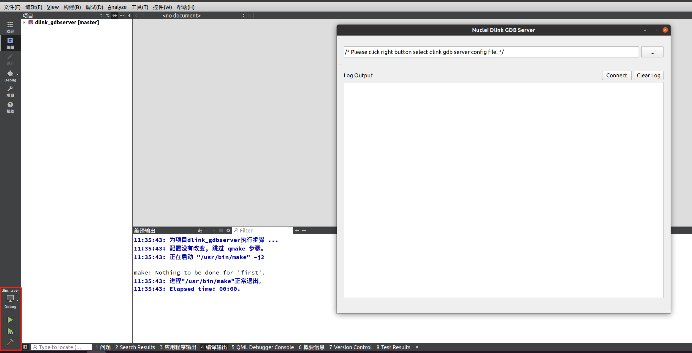

# Introduction


# QT Development Environment

- [Official Download](http://download.qt.io/)
- [中国科学技术大学](http://mirrors.ustc.edu.cn/qtproject/)
- [清华大学](https://mirrors.tuna.tsinghua.edu.cn/qt/)
- [北京理工大学](http://mirror.bit.edu.cn/qtproject/)
- [中国互联网络信息中心](https://mirrors.cnnic.cn/qt/)

| directory | description |
|--------|--------|
| archive | Various Qt development tools installation packages, both new and old (you can download the Qt development environment and source code) |
| community_releases | Community customized Qt library, Tizen Edition Qt and Qt additional source package |
| development_releases | Development Edition, which has new and old unstable versions, is an informal version in the Qt development process |
| learning | There are documentation tutorials and demonstration videos for learning Qt |
| ministro | The mini version, currently available for Android |
| official_releases | The official release is a stable version of the Qt library and development tools (you can download the Qt development environment and source code) |
| online | Qt online installation source |
| snapshots | A preview of the latest development tests in the Qt library and development tools |

> Since the latest version of QT only supports online installation, I'll use online installation as an example here


``` bash
vim ~/.bashrc

export PATH=~/Qt/Tools/QtCreator/bin:~/Qt/6.4.2/gcc_64/bin:$PATH;

source ~/.bashrc
```

# Qt In GUI Mode

```bash
qtcreator dlink_gdbserver.pro &
```


## Compile


## Run



# Qt In Command Line Mode

## Compile

```bash
cd dlink_gdbserver

qmake dlink_gdbserver.pro -o ~/build/

make --directory=~/build/
```

## Run

```bash
cd build

# Starting In GUI Mode
./dlink_gdbserver

# Starting In Command Line Mode
./dlink_gdbserver -f ../dlink_gdbserver.cfg
```
